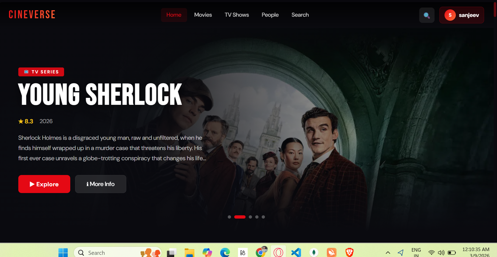
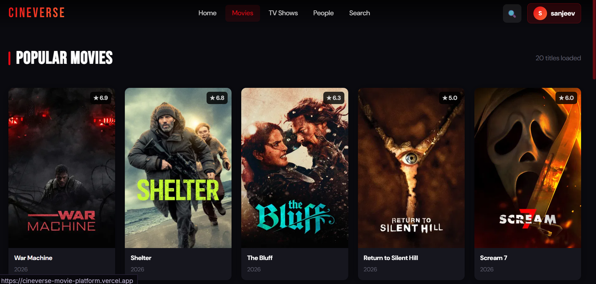
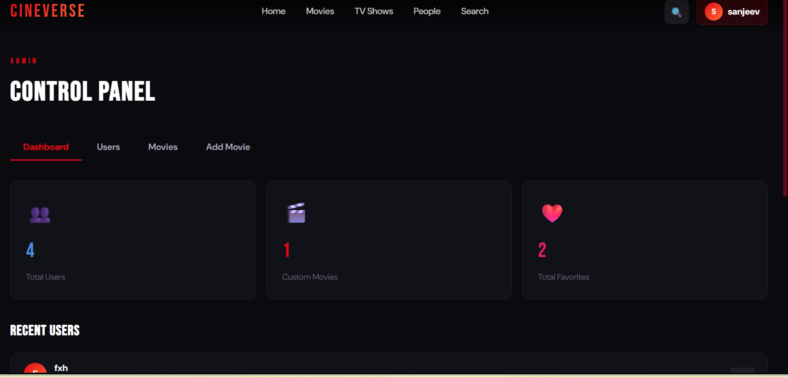

# 🎬 CineVerse — Full Stack Movie Discovery Platform

A **production-ready** MERN stack movie platform inspired by Netflix/IMDb. Discover movies, watch trailers, manage favorites, and more.

---
## 🌐 Live Demo

Frontend: https://cineverse-movie-platform.vercel.app  
Backend API: https://cineverse-movie-platform.onrender.com/api/health

## 🌟 Features

- 🎬 **TMDB Integration** — Trending, Popular, Top Rated, TV Shows, People
- 🔍 **Real-Time Search** — Debounced (500ms), searches movies, shows & people
- 🎭 **Movie Details** — Full cast, trailers, similar titles, genres
- ▶️ **Embedded Trailers** — YouTube player in modal, graceful fallback
- ❤️ **Favorites** — Add/remove favorites, persisted in MongoDB
- 🕐 **Watch History** — Auto-saved on page view/trailer watch
- 🔐 **JWT Auth** — Register, Login, Logout with protected routes
- ♾️ **Infinite Scroll** — Load more as you scroll
- ⚡ **Admin Panel** — CRUD movies, manage users, ban/delete
- 📱 **Responsive** — Mobile, tablet, desktop
- 💀 **Skeleton UI** — Smooth loading states
- 🛡️ **Error Handling** — Graceful fallbacks everywhere

---

## 🗂️ Project Structure

```
movie-platform/
├── backend/
│   ├── config/         # Database connection
│   ├── controllers/    # Business logic
│   ├── middleware/      # Auth middleware
│   ├── models/         # Mongoose schemas
│   ├── routes/         # Express routes
│   ├── server.js       # Entry point
│   └── .env.example
│
└── frontend/
    └── src/
        ├── components/
        │   ├── common/     # Navbar, SkeletonCard
        │   ├── movies/     # MovieCard, MovieSection, HeroBanner
        │   └── trailer/    # TrailerModal
        ├── hooks/          # Custom React hooks
        ├── layouts/        # MainLayout
        ├── pages/          # All page components
        │   ├── auth/       # Login, Register
        │   ├── HomePage, MoviesPage, SearchPage
        │   ├── MovieDetailPage, PersonPage
        │   ├── FavoritesPage, HistoryPage
        │   └── AdminPage
        ├── redux/
        │   ├── store.js
        │   └── slices/     # auth, movies, favorites, history, search, ui
        └── services/       # API calls (api.js, tmdb.js)
```

---

## 📸 Screenshots

### Home Page


### Movie Details


### Admin Panel



## ⚙️ Environment Variables

### Backend (`backend/.env`)

```env
PORT=5000
MONGO_URI=mongodb://localhost:27017/movieplatform
JWT_SECRET=your_super_secret_jwt_key_change_this_in_production
JWT_EXPIRE=7d
TMDB_API_KEY=your_tmdb_api_key_here
TMDB_BASE_URL=https://api.themoviedb.org/3
NODE_ENV=development
CLIENT_URL=http://localhost:5173
```

### Frontend (`frontend/.env`)

```env
VITE_API_URL=http://localhost:5000/api
VITE_TMDB_IMAGE_BASE=https://image.tmdb.org/t/p
```

---

## 🔑 TMDB API Setup

1. Go to [https://www.themoviedb.org/](https://www.themoviedb.org/)
2. Create a free account
3. Navigate to **Settings → API**
4. Request an API key (choose "Developer")
5. Copy your **API Key (v3 auth)**
6. Paste it as `TMDB_API_KEY` in your backend `.env`

> All TMDB calls are **proxied through the backend** — your API key is never exposed to the browser.

---

## 🚀 Running Locally

### Prerequisites
- Node.js v18+
- MongoDB (local or MongoDB Atlas)
- TMDB API key

### Step 1 — Backend

```bash
cd backend

# Install dependencies
npm install

# Copy and fill env
cp .env.example .env
# → Fill in MONGO_URI, JWT_SECRET, TMDB_API_KEY

# Start development server
npm run dev
```

Server runs on `http://localhost:5000`

### Step 2 — Frontend

```bash
cd frontend

# Install dependencies
npm install

# Copy and fill env
cp .env.example .env
# → VITE_API_URL=http://localhost:5000/api

# Start Vite dev server
npm run dev
```

App runs on `http://localhost:5173`

---

## 👑 Creating an Admin Account

1. Register a new account normally
2. Open MongoDB Compass or run:

```js
// In MongoDB shell
db.users.updateOne(
  { email: "your@email.com" },
  { $set: { role: "admin" } }
)
```

3. Log in — you'll see "⚡ Admin Panel" in the menu

---

## 📡 API Reference

### Auth
| Method | Route | Description |
|--------|-------|-------------|
| POST | `/api/auth/register` | Register user |
| POST | `/api/auth/login` | Login user |
| GET | `/api/auth/me` | Get current user |

### TMDB Proxy
| Method | Route | Description |
|--------|-------|-------------|
| GET | `/api/tmdb/trending/:type/:window` | Trending content |
| GET | `/api/tmdb/movies/popular` | Popular movies |
| GET | `/api/tmdb/movies/top_rated` | Top rated movies |
| GET | `/api/tmdb/movies/:id` | Movie details + credits + videos |
| GET | `/api/tmdb/tv/popular` | Popular TV shows |
| GET | `/api/tmdb/tv/:id` | TV show details |
| GET | `/api/tmdb/search?query=...` | Multi-search |
| GET | `/api/tmdb/people/popular` | Popular people |
| GET | `/api/tmdb/person/:id` | Person details |
| GET | `/api/tmdb/genres` | All genres |
| GET | `/api/tmdb/discover` | Discover by genre |

### Movies (Custom, Admin only for write)
| Method | Route | Description |
|--------|-------|-------------|
| GET | `/api/movies` | Get all custom movies |
| GET | `/api/movies/:id` | Get single movie |
| POST | `/api/movies` | Create movie (admin) |
| PUT | `/api/movies/:id` | Update movie (admin) |
| DELETE | `/api/movies/:id` | Delete movie (admin) |

### Favorites (Auth required)
| Method | Route | Description |
|--------|-------|-------------|
| GET | `/api/favorites` | Get user favorites |
| POST | `/api/favorites` | Add favorite |
| DELETE | `/api/favorites/:tmdbId` | Remove favorite |
| GET | `/api/favorites/check/:tmdbId` | Check if favorited |

### Watch History (Auth required)
| Method | Route | Description |
|--------|-------|-------------|
| GET | `/api/history` | Get watch history |
| POST | `/api/history` | Add to history |
| DELETE | `/api/history` | Clear all history |

### Admin (Admin role required)
| Method | Route | Description |
|--------|-------|-------------|
| GET | `/api/admin/stats` | Dashboard stats |
| GET | `/api/admin/users` | All users |
| DELETE | `/api/admin/users/:id` | Delete user |
| PUT | `/api/admin/users/ban/:id` | Ban/unban user |

---

## 🗄️ MongoDB Schemas

### User
```js
{ username, email, password (hashed), avatar, role: ['user','admin'], isBanned, banReason }
```

### Movie (Custom)
```js
{ title, tmdbId, posterUrl, backdropUrl, description, releaseDate, genre[], rating, trailerUrl, category, isCustom, addedBy }
```

### Favorite
```js
{ user, tmdbId, mediaType, title, posterPath, releaseDate, rating, overview }
// Unique index on (user + tmdbId)
```

### History
```js
{ user, tmdbId, mediaType, title, posterPath, releaseDate, rating, watchedAt }
// Max 50 per user, auto-pruned
```

---

## 🚢 Deployment

## 🏗️ Architecture

Frontend (Vercel)  
⬇  
Backend API (Render)  
⬇  
Database (MongoDB Atlas)

### Backend (Render / Railway / Fly.io)

1. Set all environment variables in dashboard
2. Use MongoDB Atlas for production database
3. Set `NODE_ENV=production`
4. Set `CLIENT_URL` to your frontend URL

### Frontend (Vercel / Netlify)

1. Set `VITE_API_URL` to your deployed backend URL
2. Build command: `npm run build`
3. Output: `dist/`
4. Add redirect rule for SPA routing:
   - Netlify: add `_redirects` file: `/* /index.html 200`
   - Vercel: add `vercel.json` with rewrites config

### Full-stack on Railway
```
# Both services from same repo
# Backend: root /backend, start command: node server.js
# Frontend: root /frontend, build: npm run build, serve dist/
```

---

## 🔧 Tech Stack

| Layer | Technology |
|-------|-----------|
| Frontend | React 18, Vite, Redux Toolkit |
| Routing | React Router v6 |
| HTTP Client | Axios with interceptors |
| State | Redux Toolkit slices |
| Styling | Pure CSS with CSS variables |
| Backend | Node.js, Express.js |
| Database | MongoDB with Mongoose |
| Auth | JWT + bcryptjs |
| External API | TMDB (proxied via backend) |
| Security | Helmet, rate-limiting, CORS |

---

## 💡 Performance Features

- **Lazy loading** — all pages code-split via `React.lazy()`
- **Debounced search** — 500ms delay prevents request spam
- **Infinite scroll** — IntersectionObserver, loads next page on scroll
- **Image lazy loading** — native `loading="lazy"` on all cards
- **Skeleton UI** — shimmer animation prevents layout shift
- **Redux normalization** — append-based pagination, no duplicates
- **TMDB proxy** — API key never exposed to frontend

---

## 👨‍💻 Author

**Sanjeev Jaiswal**

- GitHub: https://github.com/sanjeevjaiswal2005
- LinkedIn: https://www.linkedin.com/in/sanjeev-jaiswal2005/
Built with ❤️ — Powered by TMDB
